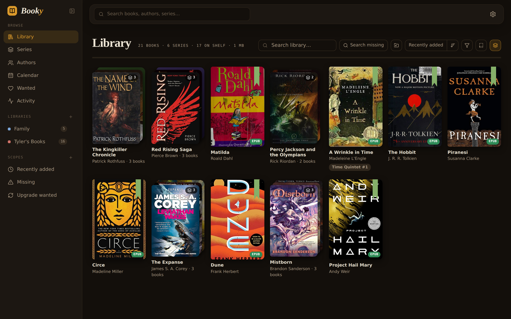
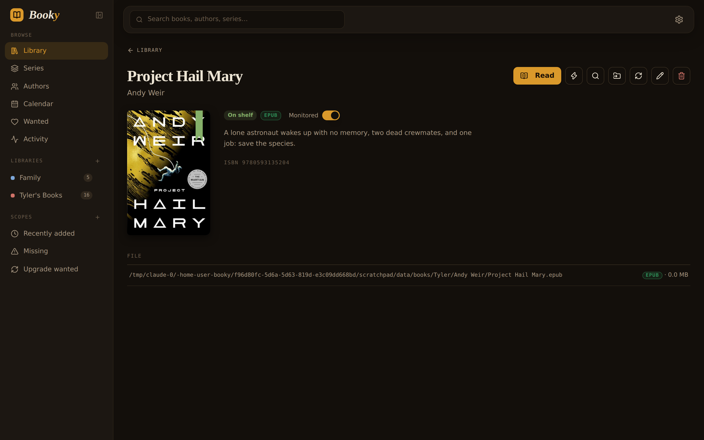
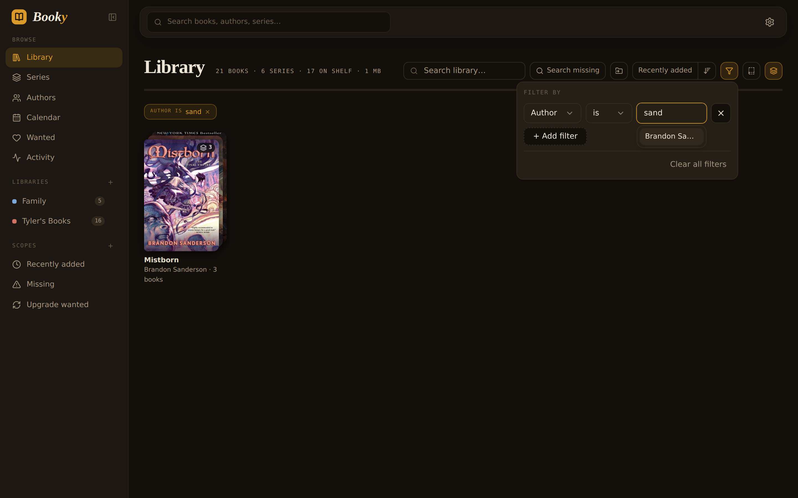
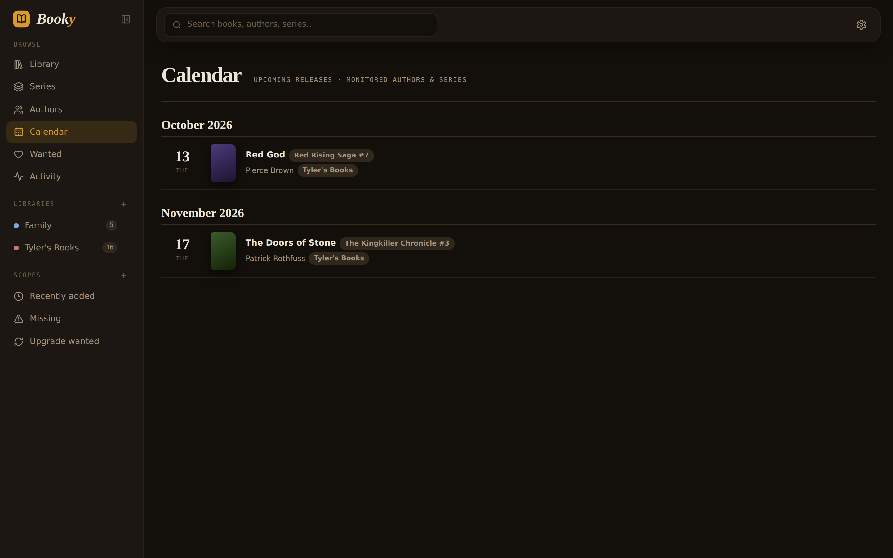
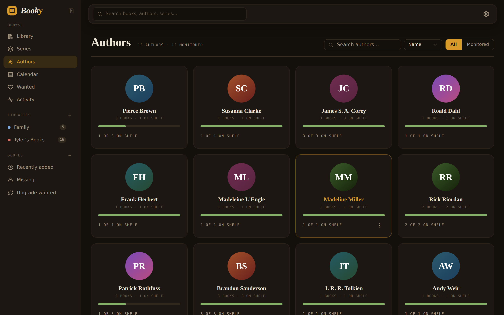
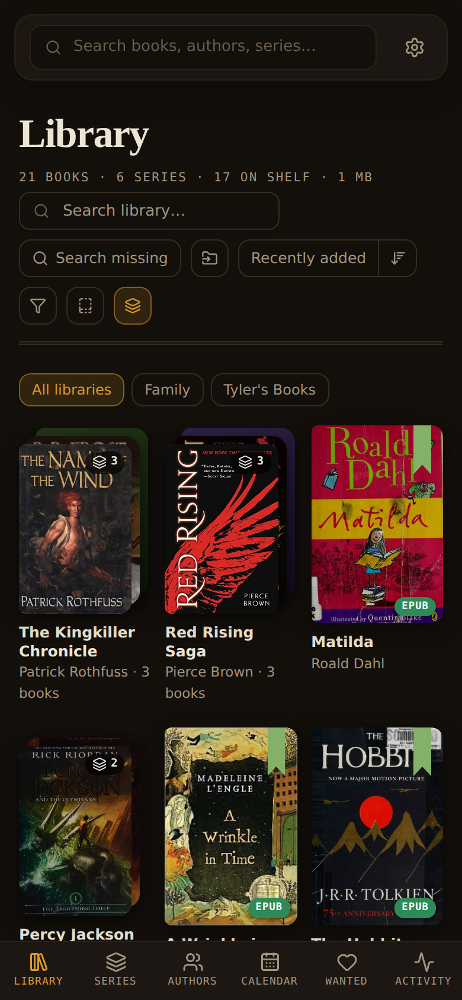

<div align="center">


# Booky

**Ebook automation for your shelf.**

Watch your Goodreads/Hardcover lists, grab new books the moment they appear or release,
file them into per-person libraries with clean embedded metadata, and read them anywhere —
in the browser, over OPDS, or synced straight to KoReader. One Docker container, no external database.




</div>

The full manual lives in [the wiki](https://github.com/getbooky/booky/wiki).

## Why

Readarr-style apps break down on book metadata (box sets shown as books, missing
releases, series chaos). Booky models Author → Series → Book → Editions correctly,
cross-links Goodreads + Hardcover + ISBN identities, and folds the library manager
(metadata writing, per-person libraries, OPDS, KoReader sync) into the same app —
so the whole loop is: add a book to your list, it shows up on your e-reader minutes later.

## A look around

| | |
| :---: | :---: |
|  |  |
| **Every book, one page** — status, format, file, and a Read button | **Composable filters** — fuzzy suggestions, results narrow as you type |
|  |  |
| **Release calendar** — monitored books searched on release day | **Authors** — bibliographies that fill themselves, shelf progress at a glance |

<div align="center">


**...and it's an installable PWA** — bottom nav, denser grids, your whole library one tap away.
</div>

## What you get

- **Watched lists** — Goodreads shelves (public RSS, just your profile URL —
  shelves are discovered with per-shelf book counts) and public Hardcover
  lists (paste a profile URL or @username to pick from their lists), polled on
  a staggered schedule. New books route into a library, optionally
  auto-searched; removals never delete files unless you say so.
- **Metadata done right** — Hardcover drives every field: titles, series,
  descriptions, covers, bibliographies. Goodreads is only ever a list source;
  its entries are matched against Hardcover and adopt the canonical record.
  Box sets / omnibus / "Books 1–3" bundles are filtered everywhere, plus your
  own exclusion terms (editable pills under Settings → Metadata). Per-field
  edit locks survive refreshes; chosen fields are written into the EPUB
  itself. Custom covers too — paste a URL or upload an image and the cover
  locks itself against refreshes.
- **Bibliographies that fill themselves** — add any book by an author and a
  background task fetches their whole backlist within seconds (paced, one
  provider query per author). It's catalog-only: browsable on the author page,
  in no library until you flip a book's monitor toggle. Monitored authors
  re-sync weekly so new releases just appear. An optional Goodreads series
  overlay fills in announced-but-unreleased books for the calendar.
- **Acquisition** — indexers via Prowlarr, plus built-in Anna's Archive and
  Z-Library direct downloads. Each source can be toggled on/off, mirror lists
  are editable pills, and a Source Priority card sets the order they're tried.
  Format-first ranking with per-library quality profiles and cutoff upgrades.
- **Failure handling that keeps going** — a failed download blocklists that
  release and automatically cascades to the next-best candidate until
  something imports or the options run out. Import failures show their reason
  in Activity with **Retry import** and **Manual import** actions right on the
  row.
- **Manual import & uploads** — point Booky at a file or folder on the server,
  or upload straight from whatever device you're browsing on (phone included).
  Uploads are validated server-side by extension *and* file signature — only
  real ebook files get through. Import into any library from a book's page, or
  use a library's Import book action for books not in Booky yet.
- **Release-day automation** — monitored future books sit on the Calendar,
  dates refresh weekly, and each book is searched on release day with a short
  taper. An opt-in weekly backlog pass re-searches missing and below-cutoff
  books.
- **A library you can actually browse** — series collapse into stacks of
  covers, composable filters (field · is / is not · value) suggest your
  library's real authors, series, and genres with fuzzy matching, and the
  shelf narrows live as you type. Smart scopes (Recently added, Missing,
  Upgrade wanted) and your own saved scopes live in the sidebar.
- **Read it right there** — a built-in EPUB reader (foliate-js) with per-user
  reading positions that sync across devices. Or point any OPDS reader at a
  library's feed.
- **Per-person libraries** — each library is a root folder with its own
  quality profile and its own OPDS feed (HTTP basic auth, works with any OPDS
  reader). Imports are hardlink + rename: atomic, instant, no duplicate bytes
  across libraries.
- **KoReader devices** — build a preconfigured plugin zip per device; it syncs
  over wifi and auto-downloads new arrivals from the libraries you chose.
  Revoke a device and its token dies instantly.
- **Send to Kindle** — email a book (EPUB/PDF) straight to a Kindle's
  @kindle.com address, Calibre-style, with optional auto-send on import.
  Every account pairs its own devices and sends from its own email; SMTP
  passwords are write-only and encrypted at rest.
- **Works great on your phone** — installable PWA with bottom navigation,
  denser grids, and safe-area-aware layout. Pair it with Tailscale and your
  whole library is a tap away from anywhere.
- **The boring essentials** — local accounts (bcrypt, rate-limited login,
  admin/user roles with per-library access), weekly zipped backups with
  one-click restore, health checks, in-app logs, first-run wizard.

## Running (unraid / Docker)

```
docker run -d --name booky \
  --restart=unless-stopped \
  -p 8787:8787 \
  -e PUID=99 -e PGID=100 -e UMASK=022 \
  -v /mnt/user/appdata/booky:/config \
  -v /mnt/user/data:/data \
  ghcr.io/getbooky/booky:latest
```

- **Keep downloads and library roots under the same `/data` mount** — that's
  what makes imports instant hardlinks instead of copies. Point SABnzbd's
  completed folder and Booky's library roots at paths inside it.
- **Stored credentials are encrypted at rest** (SMTP passwords, provider
  tokens). The key is auto-generated into `/config/secret.key` on first boot —
  or supply your own with `-e BOOKY_SECRET_KEY=<64 hex chars>` (e.g.
  `openssl rand -hex 32`), which keeps the key entirely out of `/config` so
  even filesystem access to the volume can't decrypt them. The key is never
  included in backups either way.
- `--restart=unless-stopped` matters: the in-app Restart button and
  backup-restore work by exiting and letting Docker bring Booky back.
- On unraid: Docker tab → Add Container → fill in the same repository, port,
  paths and variables. PUID 99 / PGID 100 are the unraid defaults.

Then open `http://<server>:8787`. The first-run wizard opens with the one
required step — creating your admin account — then walks through libraries →
metadata → quality profile → sources → SABnzbd → watched lists → e-readers →
Send to Kindle. Everything after the account is skippable and lives in
Settings afterward.

**Auth model**: creating the admin account is the wizard's first, mandatory
step — the API is open only for that brief first-run window and locks the
moment the account exists. OPDS feeds and KoReader devices use their own
credentials, never your account.

**Roles**: admins run the install. A `user` is given a specific set of
libraries when you create them and only ever sees those: inside them they can
browse, search and add books, refresh metadata, monitor authors and series,
and pair their own e-reader — but not edit metadata by hand, delete anything,
or open Settings. Change a user's libraries any time from Settings → Users;
it takes effect on their next click. Authors and series follow the books — add
a book to someone's library and its author and series show up for them too.
Series are shelved with **Add series to library**, which names the library it
goes into — a user only sees the libraries assigned to them, and is not asked
at all when they have just one. Users can take a book back off their own shelf;
deleting files and blocklisting stay with the admin.

**Remote access**: Booky pairs well with Tailscale — run the container as a
tailnet node (Booky listens on 8787 inside the container) and reach it by
MagicDNS name from your phone; add it to your home screen as a PWA.

## Hooking things up

| What | Where | Notes |
| --- | --- | --- |
| Goodreads shelf | Settings → Watched Lists | shelf must be public; paste your profile URL and pick shelves |
| Hardcover | Settings → Metadata (token), then Watched Lists | token from hardcover.app → settings → API; watch any public list |
| Prowlarr | Settings → Sources | URL + API key; indexers sync automatically |
| SABnzbd | Settings → Download Clients | completed folder must live under `/data` |
| Anna's / Z-Library | Settings → Sources | optional accounts; toggle sources and edit mirrors |
| OPDS reader | Settings → Libraries → set credentials | feed at `/opds/<library id>`; row shows a ✓ once configured |
| KoReader | Settings → KoReader Devices | set the Server URL, download the zip, drop `booky.koplugin/` into KOReader's `plugins/` folder |

## Development

```
# frontend (React 19 + Tailwind + shadcn/ui)
cd web && corepack enable && pnpm install && pnpm build

# backend (Go 1.26, embeds web/dist)
go build ./cmd/booky
BOOKY_CONFIG_DIR=./config ./booky
```

---

<div align="center">
<sub>The screenshots show a demo library in Booky's default dark "reading-room" theme — it follows your system's
light/dark preference. Books without cover art yet (like unreleased ones) get a clean gradient placeholder.</sub>
</div>
